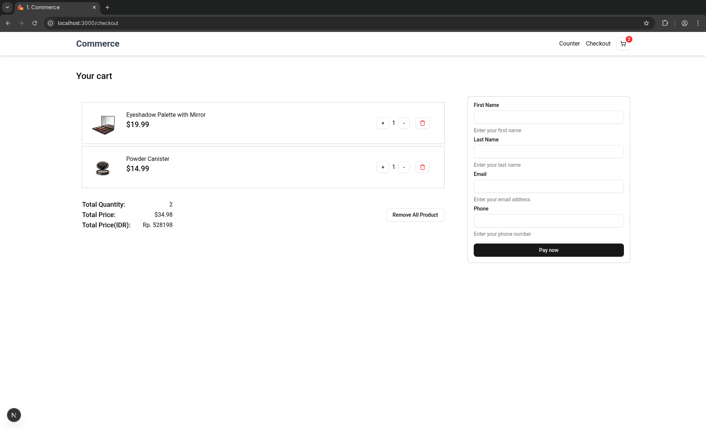

# Commerce

A simple e-commerce application built with modern web technologies.

## 🚀 Live Demo

[View the live application](https://commerce-five-delta-74.vercel.app/)

## 🛠️ Tech Stack

- **Next.js** - React framework for production
- **Shadcn/ui** - Beautiful and accessible UI components
- **Redux Toolkit** - State management
- **Midtrans** - Payment gateway integration

## ⚡ Quick Start

### 1. Clone the repository

```bash
git clone https://github.com/jarfiz/commerce.git
cd commerce
```

### 2. Install dependencies

```bash
npm install
# or
pnpm install
# or
yarn install
# or
bun install
```

### 3. Environment setup

Create a `.env` file in the root directory:

```bash
NEXT_PUBLIC_CLIENT_KEY=your_midtrans_client_key_here
CLIENT_KEY=your_midtrans_client_key_here
```

### 4. Start development server

```bash
npm run dev
# or
pnpm dev
# or
yarn dev
# or
bun dev
```

Open [http://localhost:3000](http://localhost:3000) in your browser.

## � Screenshots


_Home page with product listings_


_Shopping cart and checkout process_


_Payment confirmation page_

## �📝 Credits

Icons: [Shopping bag icons by iconixar - Flaticon](https://www.flaticon.com/free-icons/shopping-bag)
